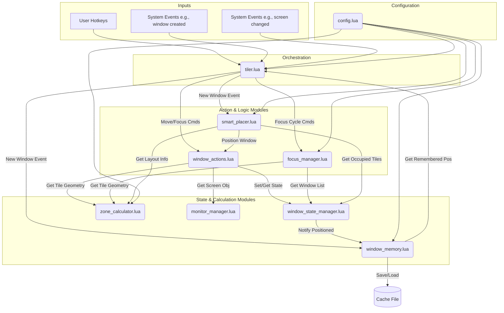

# ZoneTilerWM Architecture

This document provides a high-level overview of the ZoneTilerWM architecture. The system is designed to be modular, with each Lua file in the `modules/` directory having a distinct responsibility.

## Core Philosophy

The design centers around a main `tiler.lua` module that acts as an orchestrator. It receives input from user hotkeys and system events (like screen changes or new windows) and delegates the actual work to specialized modules. This separation of concerns makes the system easier to debug, maintain, and extend.

## System Flow Diagram

The following diagram illustrates the primary interactions between the core modules.

## Module Responsibilities

### Core
*   **`tiler.lua`**: The central hub and orchestrator. It initializes all other modules, binds hotkeys, subscribes to system events (window/screen changes), and delegates tasks to the appropriate logic or action module.
*   **`config.lua`**: The single source of truth for all user-configurable settings, including layouts, keybindings, colors, and feature toggles.

### State & Calculation
*   **`monitor_manager.lua`**: Provides stable, persistent IDs for physical monitors, ensuring that layouts are applied correctly even if screens are disconnected and reconnected in a different order.
*   **`zone_calculator.lua`**: Determines the correct grid layout for each monitor (e.g., 4x3, 2x2) and calculates the exact pixel geometry for every tile within every zone.
*   **`window_state_manager.lua`**: Tracks the *current, in-memory state* of each tiled window (which zone and tile it occupies) for the active session. It acts as the live database for window positions.
*   **`window_memory.lua`**: Remembers window positions *across sessions*. It saves/loads preferences to/from disk, learns user habits, and provides remembered positions for new windows.

### Action & Logic
*   **`window_actions.lua`**: Contains the low-level functions for manipulating windows (moving, resizing, applying frames). It's the "muscle" of the tiler, handling the direct `hs.window` API calls.
*   **`focus_manager.lua`**: Manages the complex logic for cycling focus between windows within a specific zone. It determines which windows belong to a zone and in what order they should be focused.
*   **`smart_placer.lua`**: Intelligently finds the next available empty tile on a monitor to place newly created windows that don't have a remembered position.
*   **`placement_strategy.lua`**: Determines the best tile for a window based on a chosen strategy (e.g., rotation, largest free space). This module works in conjunction with `smart_placer.lua`.

### Utility & Features
*   **`app_switcher.lua`**: Handles the logic for launching and focusing applications via dedicated hotkeys, including workarounds for ambiguously named apps.
*   **`pomodoor.lua`**: Implements the self-contained Pomodoro timer feature, including the menubar display and visual indicators.
*   **`lru_cache.lua`**: A generic, reusable Least Recently Used (LRU) cache utility.

### Spoons
*   **`Spoons/RoundedCorners.spoon/init.lua`**: A third-party Spoon used to render rounded corners on screens for aesthetic purposes. It is independent of the core tiling logic.

---

This architecture allows for new features to be added by creating new modules or extending existing ones with minimal impact on the rest of the system.