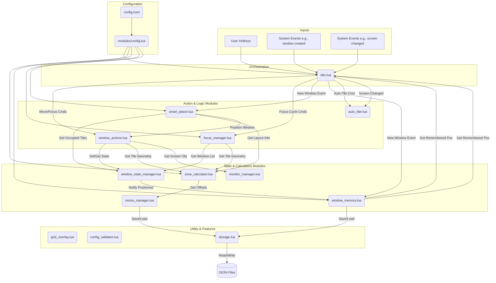

# ZoneTilerWM Architecture

This document provides a high-level overview of the ZoneTilerWM architecture. The system is designed to be modular, with each Lua file in the `modules/` directory having a distinct responsibility.

## Core Philosophy

The design centers around a main `tiler.lua` module that acts as an orchestrator. It receives input from user hotkeys and system events (like screen changes or new windows) and delegates the actual work to specialized modules. This separation of concerns makes the system easier to debug, maintain, and extend.

## Core Design Values

* **Cognitive Offloading via Smart Memory:** The most significant outcome is how the system learns and automates window placement. It remembers where you prefer to place each application, so over time, your workspace organizes itself with minimal intervention. This goes beyond simple layout management and actively reduces the user's cognitive load.

* **Seamless Multi-Monitor Experience:** The "Smart Screen Detection" provides a "plug-and-play" feel for complex monitor setups. Users don't need to manually configure layouts every time they connect a new display; the system intelligently adapts based on screen size, brand, and even orientation, making it ideal for people who frequently switch between different work environments (e.g., office, home, mobile).

* **Integrated Productivity Discipline:** By building a Pomodoro timer directly into the window manager, it integrates a popular time management technique into the user's core workflow. This is unique because it treats productivity discipline as a first-class citizen of the desktop experience, rather than a separate, add-on application.

* **Intuitive, Kinesthetic Control:** The zone-based tiling system, which maps a grid directly to keyboard keys, creates a strong physical and mental connection between the user's hands and the window layout. This allows for a highly intuitive and "eyes-free" operation, where managing windows becomes a matter of muscle memory rather than a visual drag-and-drop task.

## System Flow Diagram

The following diagram illustrates the primary interactions between the core modules.

## Module Responsibilities

### Core

* **`tiler.lua`**: The central hub and orchestrator. It initializes all other modules, binds hotkeys, subscribes to system events (window/screen changes), and delegates tasks to the appropriate logic or action module.
* **`config.toml`**: The single source of truth for all user-configurable settings, including layouts, keybindings, colors, and feature toggles.
* **`modules/config.lua`**: Loads and parses `config.toml`, handling post-processing and exposing the configuration to other modules.

### State & Calculation

* **`monitor_manager.lua`**: Provides stable, persistent IDs for physical monitors, ensuring that layouts are applied correctly even if screens are disconnected and reconnected in a different order.
* **`zone_calculator.lua`**: Determines the correct grid layout for each monitor (e.g., 4x3, 2x2) and calculates the exact pixel geometry for every tile within every zone.
* **`window_state_manager.lua`**: Tracks the *current, in-memory state* of each tiled window (which zone and tile it occupies) for the active session. It acts as the live database for window positions.
* **`window_memory.lua`**: Remembers window positions *across sessions*. It saves/loads preferences to/from disk, learns user habits, and provides remembered positions for new windows.
* **`resize_manager.lua`**: Manages the dynamic offsets for grid lines. It allows users to adjust the size of zones without editing the config file.

### Action & Logic

* **`window_actions.lua`**: Contains the low-level functions for manipulating windows (moving, resizing, applying frames). It's the "muscle" of the tiler, handling the direct `hs.window` API calls.
* **`focus_manager.lua`**: Manages the complex logic for cycling focus between windows within a specific zone. It determines which windows belong to a zone and in what order they should be focused.
* **`smart_placer.lua`**: Uses an advanced weighted scoring system (Area vs Position) to find the absolute best spot for a window. It handles gap-filling by applying continuous penalties for overlaps and excessive size (coverage), ensuring the grid stays dense and open.
* **`auto_tiler.lua`**: Orchestrates the global re-tiling process. It delegates the complex decision-making to `layout_solver.lua` to determine the optimal layout. Includes a "Fill Gaps" pass that uses a grid-based occupancy map to iteratively optimize tile assignments and fill unused screen space.
* **`layout_solver.lua`**: Implements a Cost-Based Backtracking Solver to find the mathematically optimal assignment of windows to tiles, respecting spatial constraints (overlaps) and weighting factors (Memory, Aspect Ratio, Area).
* **`placement_strategy.lua`**: Determines the best tile for a window based on a chosen strategy (e.g., rotation, largest free space). This module works in conjunction with `smart_placer.lua`.

### Utility & Features

* **`app_switcher.lua`**: Handles the logic for launching and focusing applications via dedicated hotkeys, including workarounds for ambiguously named apps.
* **`audio_switcher.lua`**: Provides two functions for managing audio outputs. First, it allows manual cycling through a predefined list of audio devices via a hotkey. Second, it automatically listens for changes to the system's default audio output device and triggers a user-defined macOS Shortcut. This is configured in `config.lua` via the `shortcut_callback` key.
* **`pomodoor.lua`**: Implements the self-contained Pomodoro timer feature, including the menubar display and visual indicators.
* **`layout_manager.lua`**: Manages layout persistence, allowing saving and restoring of window layouts.
* **`lru_cache.lua`**: A generic, reusable Least Recently Used (LRU) cache utility.
* **`storage.lua`**: Provides a robust abstraction for saving and loading data to JSON files. It handles file I/O, JSON encoding/decoding, and error checking.
* **`config_validator.lua`**: Validates the loaded configuration against a defined schema to prevent runtime errors during initialization.
* **`grid_overlay.lua`**: Renders a visual grid on the screen using `hs.canvas`. This is used to provide feedback during dynamic resizing.

### macOS Spaces Support

* **`space_manager.lua`**: Core Spaces management, handles space switching and change detection.
* **`space_menubar.lua`**: Menubar indicator showing current space with visual brackets.
* **`space_preview.lua`**: Visual preview of all spaces with window thumbnails and drag-and-drop support.
* **`space_storage.lua`**: Persistence for space definitions and custom names.

### Debug System

* **`debug/init.lua`**: Main entry point for the debug system, provides unified API via `zt_debug`.
* **`debug/config.lua`**: Centralized configuration for all debug features.
* **`debug/logger.lua`**: Multi-level logging system with module-specific controls.
* **`debug/keystroke_monitor.lua`**: Keyboard event monitoring for debugging key bindings.
* **`debug/inspection.lua`**: State inspection utilities for zones, windows, and focus.

---

This architecture allows for new features to be added by creating new modules or extending existing ones with minimal impact on the rest of the system.
